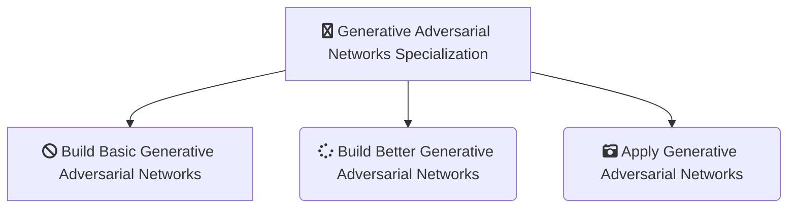

-------------------------------------------------------------------------------------------

-------------------------------------------------------------------------------------------

# [DeepLearning.AI - Generative Adversarial Networks (GANs) Specialization](https://in.coursera.org/specializations/generative-adversarial-networks-gans#instructors)
*This Repository Contains Solution to the Assignments of the Generative Adversarial Networks (GANs) Specialization from deeplearning.ai on Coursera Taught by 
[Sharon Zhou](https://in.coursera.org/instructor/sharon-zhou),
[Eda Zhou](https://in.coursera.org/instructor/eda-zhou),
[Eric Zelikman](https://in.coursera.org/instructor/eric-zelikman)*

-------------------------------------------------------------------------------------------

## WHAT YOU WILL LEARN

- Understand GAN components, build basic GANs using PyTorch and advanced DCGANs using convolutional layers, control your GAN and build conditional GAN
- Compare generative models, use FID method to assess GAN fidelity and diversity, learn to detect bias in GAN, and implement StyleGAN techniques
- Use GANs for data augmentation and privacy preservation, survey GANs applications, and examine and build Pix2Pix and CycleGAN for image translation

---

## About this Specialization

The DeepLearning.AI Generative Adversarial Networks (GANs) Specialization provides an exciting introduction to image generation with GANs, charting a path from foundational concepts to advanced techniques through an easy-to-understand approach. It also covers social implications, including bias in ML and the ways to detect it, privacy preservation, and more.

Build a comprehensive knowledge base and gain hands-on experience in GANs. Train your own model using PyTorch, use it to create images, and evaluate a variety of advanced GANs. 

---

## Applied Learning Project

- Course 1: In this course, you will understand the fundamental components of GANs, build a basic GAN using PyTorch, use convolutional layers to build advanced DCGANs that processes images, apply W-Loss function to solve the vanishing gradient problem, and learn how to effectively control your GANs and build conditional GANs.

- Course 2: In this course, you will understand the challenges of evaluating GANs, compare different generative models, use the Fréchet Inception Distance (FID) method to evaluate the fidelity and diversity of GANs, identify sources of bias and the ways to detect it in GANs, and learn and implement the techniques associated with the state-of-the-art StyleGAN.

- Course 3: In this course, you will use GANs for data augmentation and privacy preservation, survey more applications of GANs, and build Pix2Pix and CycleGAN for image translation.

-------------------------------------------------------------------------------------------------------------

## There are 3 Courses in this Specialization

### COURSE 1
### Build Basic Generative Adversarial Networks (GANs)

In the first course of the Generative Adversarial Networks (GANs) Specialization, you will:
- Learn about GANs and their applications
- Understand the intuition behind the fundamental components of GANs
- Explore and implement multiple GAN architectures
- Build conditional GANs capable of generating examples from determined categories

* [Build Basic Generative Adversarial Networks (GANs)](https://github.com/shantanu1109/Coursera-DeepLearning.AI-GANs-Specialization/tree/main/Course-1-Build%20Basic%20Generative%20Adversarial%20Networks%20(GANs))

### COURSE 2
### Build Better Generative Adversarial Networks (GANs)

In the second course of the Generative Adversarial Networks (GANs) Specialization, you will:
- Assess the challenges of evaluating GANs and compare different generative models
- Use the Fréchet Inception Distance (FID) method to evaluate the fidelity and diversity of GANs
- Identify sources of bias and the ways to detect it in GANs
- Learn and implement the techniques associated with the state-of-the-art StyleGANs

* [Build Better Generative Adversarial Networks (GANs)](https://github.com/shantanu1109/Coursera-DeepLearning.AI-GANs-Specialization/tree/main/Course-2-Build%20Better%20Generative%20Adversarial%20Networks%20(GANs))

### COURSE 3
### Apply Generative Adversarial Networks (GANs)
In the third course of the Generative Adversarial Networks (GANs) Specialization, you will:
- Explore the applications of GANs and examine them wrt data augmentation, privacy, and anonymity
- Leverage the image-to-image translation framework and identify applications to modalities beyond images
- Implement Pix2Pix, a paired image-to-image translation GAN, to adapt satellite images into map routes (and vice versa)
- Compare paired image-to-image translation to unpaired image-to-image translation and identify how their key difference necessitates different GAN architectures
- Implement CycleGAN, an unpaired image-to-image translation model, to adapt horses to zebras (and vice versa) with two GANs in one

* [Apply Generative Adversarial Networks (GANs)](https://github.com/shantanu1109/Coursera-DeepLearning.AI-GANs-Specialization/tree/main/Course-3-Apply%20Generative%20Adversarial%20Networks%20(GANs))

-------------------------------------------------------------------------------------------------------------

## Certificate

1. [Build Basic Generative Adversarial Networks (GANs)](https://www.coursera.org/account/accomplishments/certificate/UAYE5U978RYB)
2. [Build Better Generative Adversarial Networks (GANs)](https://www.coursera.org/account/accomplishments/certificate/G633LWXC24FW)
3. [Apply Generative Adversarial Networks (GANs)]()
4. [Generative Adversarial Networks Specialization (Final Certificate)]()

--------------------------------------------------------------------------------------------------------------

## References
1. [Build Basic Generative Adversarial Networks (GANs)](https://in.coursera.org/learn/build-basic-generative-adversarial-networks-gans?specialization=generative-adversarial-networks-gans)
2. [Build Better Generative Adversarial Networks (GANs)](https://in.coursera.org/learn/build-better-generative-adversarial-networks-gans?specialization=generative-adversarial-networks-gans)
3. [Apply Generative Adversarial Networks (GANs)](https://in.coursera.org/learn/apply-generative-adversarial-networks-gans?specialization=generative-adversarial-networks-gans)

----------------------------------------------------------------------------------------------------------------

## 📝 Disclaimer 
I made this repository as *a reference*. Please do not copy paste the solution as is. You can find the solution if you read the instruction carefully. 

 
## 📝 License
The gem is available as open source under the terms of the [MIT License](https://opensource.org/licenses/MIT).
 
-----------------------------------------------------------------------------------------------------------------

